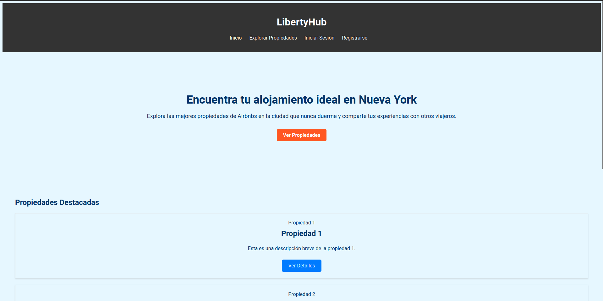
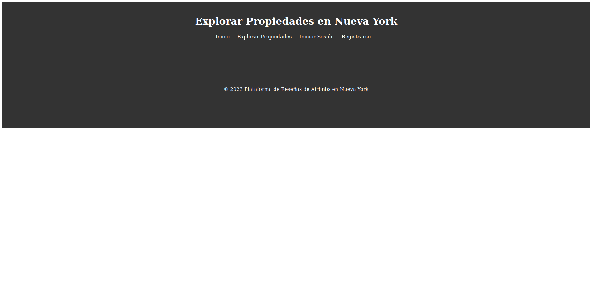

<p align="left"> 
     
    

# Documentación del Proyecto

## LibertyHub

`Proyecto Redes e Infraestructura - Primera parte`
## Tabla de Contenidos

1. [Introducción](#introducción)
2. [Participantes](#participantes)
3. [Requisitos](#requisitos)
4. [Instalación](#instalación)

## Introducción

Plataforma de Reseñas de Airbnbs en Nueva York

La Plataforma busca brindar a los usuarios la oportunidad de buscar y evaluar propiedades de Airbnbs junto a su confiabilidad en la vibrante ciudad de Nueva York. Nuestra plataforma tiene como objetivo principal facilitar la toma de decisiones a la hora de elegir un alojamiento, al proporcionar acceso a información detallada y reseñas honestas de otros usuarios.

Este proyecto consta de varios microservicios, cada uno con un propósito específico y complementario. A continuación, presentamos una breve descripción de los principales microservicios que formarán parte de nuestra plataforma:

#### Microservicios presentes:
**Listado de Propiedades:** Este microservicio se encargaría de gestionar la información relacionada con las propiedades de AirBnB en Nueva York. Los usuarios podrían buscar, ver detalles y reservar propiedades a través de este servicio.

**Reseñas:** Este microservicio permitirá a los usuarios dejar reseñas y calificaciones para las propiedades en las que se han alojado. También puede incluir la funcionalidad para que los usuarios vean reseñas anteriores y calificaciones.

**Autenticación y Gestión de Usuarios:** Este microservicio se encarga de la autenticación de usuarios y la gestión de perfiles de usuario en la plataforma de reseñas de Airbnbs en Nueva York. Su función principal es garantizar la identidad de los usuarios.

## Participantes

- Juan Pablo Ramirez
- Danna Salamanca
- Juan Pablo Granados
- Juliana Serrano
- Isaac Piedrahita

## Requisitos

Lista de requisitos necesarios para utilizar o contribuir al proyecto. Esto podría incluir software, hardware o configuraciones específicas.

## Instalación

Instrucciones detalladas sobre cómo instalar y configurar el proyecto en un entorno local o en un servidor.

```bash
# Template Comando Bash
npm install mi-proyecto
```

Página actual: 

`index.html`
 

`explore.html (misma plantilla para las demás secciones)`
 